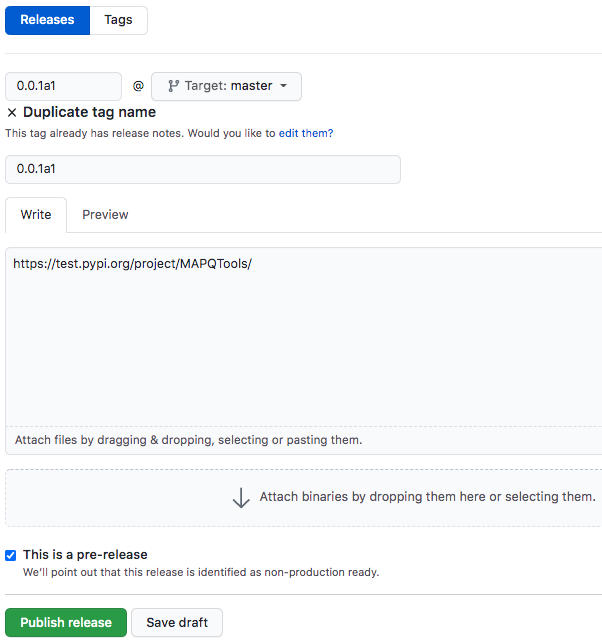

Uploading your package to PyPI
==============================

Our ultimate goal is to upload our package so it can be used by anyone.
The `Python Package Index (PyPI) <https://pypi.org/>`_ is a repository of software for Python. It contains
numerous packages that can all be installed in the following format:

.. code:: bash

	pip install <package_name>

You can search packages in `PyPI <https://pypi.org/>`_. In this section of the tutorial, we will go over
how to upload projects to PyPI.

Building your package
---------------------

We will use setuptools to build our package. To build our distribution,
use the following command:

.. code:: bash

	python setup.py sdist bdist_wheel

This generates the following files in the ``dist`` output directory:

.. code:: bash

	dist/
		- PlotMAPQ-py3-none-any.whl
		- PlotMAPQ-0.0.1.tar.gz

Here, ``tar.gz`` is a source archive and ``.whl`` is a build distribution. Depending on the pip version,
pip will choose one of these files to install your package.

Uploading to PyPI
-----------------

The next step is to upload our package to PyPI so others can use it! However, this is a tutorial,
so we don't really want to upload it to PyPI. To get an idea of how PyPI works, we will use `test PyPI <https://test.pypi.org/>`_ to test uploading our package.

1. First, `make an account on test Pypi <https://test.pypi.org/account/register/>`_.
2. Verify your email address.
3. If you want to test uploading this project to PyPI, you will have to change the name of the project to be unique, because I already am using the name MAPQTools. To do so, change ``name="MAPQTools"`` to ``name="MAPQTools-YOUR-USERNAME"`` in ``setup.py`` to create a unique project name.

We will use twine to upload distribution packages we created in the previous section. First, let's install twine:

.. code:: bash

	pip install twine

Next we can run twine to upload all files under dist:

.. code:: bash

	python -m twine upload --repository-url https://test.pypi.org/legacy/ dist/*

**Note**: Normally, I use my Makefile to prepare and publish packages on PyPI.
See the ``make pypi`` command in the Makefile. This command automatically builds your distribution
and uploads to PyPI.

Here, enter your testPyPI username and password.
Once uploaded, the package should be available at
https://test.pypi.org/project/MAPQTools-YOUR-USERNAME. My package is available at https://test.pypi.org/project/MAPQTools/.

Now, you can install your package from PyPI:

.. code:: bash

	pip install -i https://test.pypi.org/simple/ MAPQTools-YOUR-USERNAME

**Note**: testPyPI is a great way to test publishing packages. However, when publishing a
package, you will normally publish to https://pypi.org/. You can `make an account for PyPI <https://pypi.org/account/register/>`_ and upload to this repository for future projects.

Tagging a release on GitHub
---------------------------

Now that we have uploaded to PyPI, we want to `create a release <https://docs.github.com/en/free-pro-team@latest/github/administering-a-repository/managing-releases-in-a-repository>`_.
This allows us to tag our repository at a certain point in time. It also allows users who visit our GitHub to see which releases are available.

1. To tag a release, click **Create a new release** in the right sidebar on your GitHub home package.

2. Fill in information regarding the release. Note that you can check **This is a pre-release** if your release is not yet stable.

