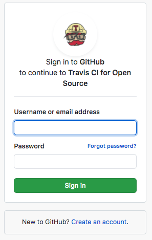
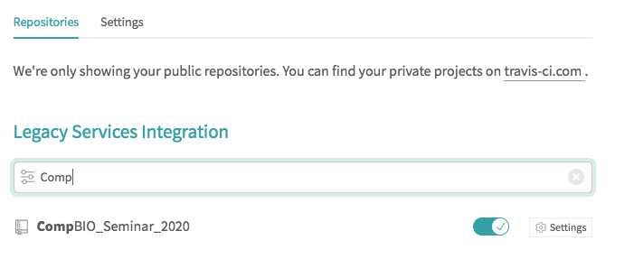

Unit tests and Continuous Integration
=====================================

Testing your code is a great way to make sure your code is working as expected
and that new additions to your code do not break existing functionality. The first
thing we need to test our code is unit tests. Unit tests are small tests that
isolate certain functionality of your code. Ideally, your unit tests comprehensively
cover a majority of the functionality in your code base.

We have added unit tests `in our GitHub <https://github.com/akmorrow13/CompBIO_Seminar_2020/tree/master/PlotMAPQ/test>`_ under ``PlotMAPQ/tests``.
There are three unit tests that test core functions and our command line tool.
These tests use `unittest <https://docs.python.org/2/library/unittest.html>`_ to run tests.

To run the tests, we simply run:

.. code:: bash

	make test

This triggers pytest to run using the command:

.. code:: bash

	$(python) -m pytest -vv --junitxml target/pytest-reports/tests.xml $(tests)

Continuous Integration with Travis
----------------------------------

Once we have added unit tests, it would be helpful to automatically run tests every time
our code changes. To do this, we can use existing continuous integration tools to
test our code. Here, we choose to use ``travis-ci <https://docs.travis-ci.com>``_ to run our tests. Travis-ci is free
for public repositories, and can run unit tests every time code is updated or a pull
request is made. You can find documentation for `travis here <https://docs.travis-ci.com/user/tutorial/>`_.

Note that every repository that uses travis requires a ``.travis.yml`` file. You can find `our travis file here <https://github.com/akmorrow13/CompBIO_Seminar_2020/blob/master/.travis.yml>`_.
This file contains information on what build requirements your project has and how to run tests.

1. To use Travis, `first make an account <https://github.com/login?client_id=f244293c729d5066cf27&return_to=%2Flogin%2Foauth%2Fauthorize%3Fclient_id%3Df244293c729d5066cf27%26redirect_uri%3Dhttps%253A%252F%252Fapi.travis-ci.org%252Fauth%252Fhandshake%252Fgithub%26scope%3Dread%253Aorg%252Cuser%253Aemail%252Crepo_deployment%252Crepo%253Astatus%252Cwrite%253Arepo_hook%26state%3Dou_8WgYq4c9SkWTCU_Vs6A%253A%253A%253Ahttps%253A%252F%252Ftravis-ci.org%252F>`_. You will have to link this with your GitHub so it can access your repositories. 

2. Next, navigate to your user settings. You can toggle projects from your GitHub on and off.

To see our unit tests in action, navigate to our `Travis tests for this project <https://travis-ci.org/github/akmorrow13/CompBIO_Seminar_2020>`_.
