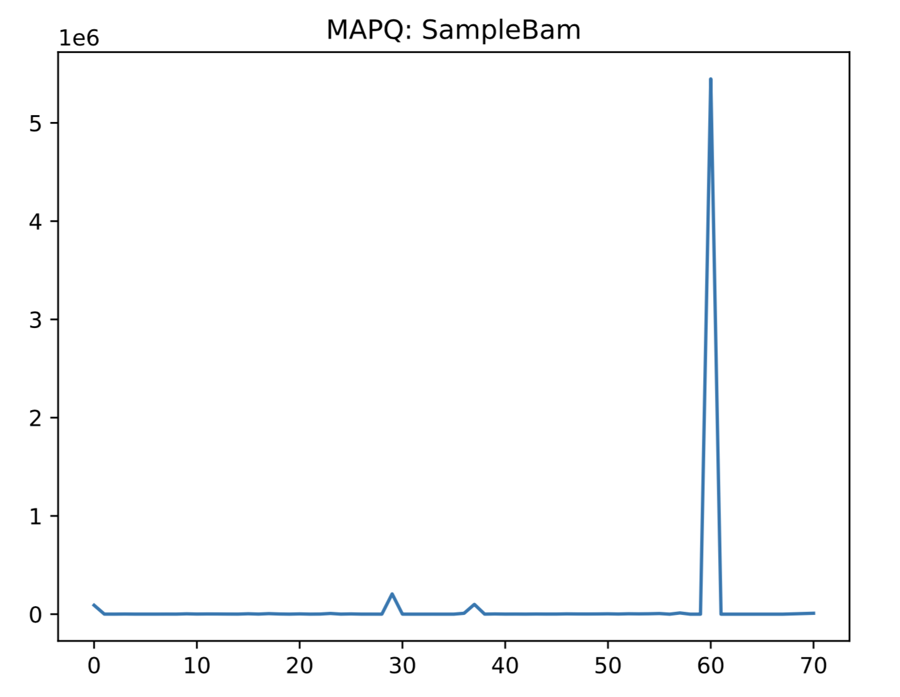

Tutorial
========

This tutorial shows you how to build a python package with the minimum components
for a clean and well engineered package. In this tutorial, you will learn how to
setup a project, how to build and implement unit tests, how to create documentation,
and how to publish your tool to bioconda and PyPI.

In this tutorial, we will build a simple project that plots mapping quality distribution
from an `input bam file <https://genome.ucsc.edu/goldenPath/help/bam.html>`_. Below is a 
sample plot that our tool produces:

.. toctree::
   :caption: Tutorial Outline
   :maxdepth: 2

   prerequisites
   project
   commandline
   testing
   pypi
   conda
   documentation
   end

Let's get started!
